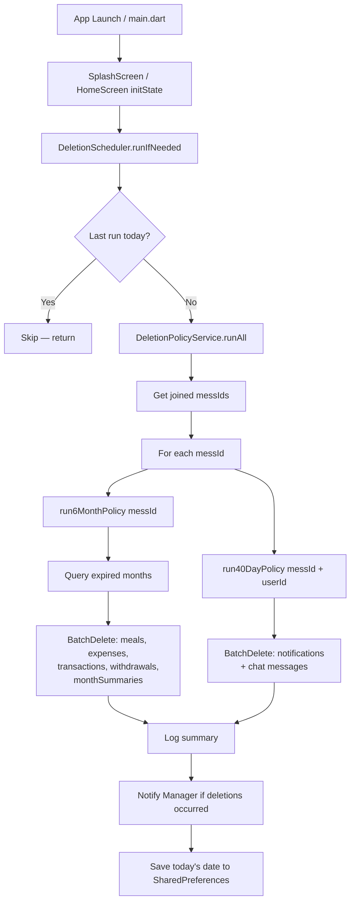

# Design Document: Data Deletion Policy

## Overview

এই ফিচারটি Flutter + Firestore-ভিত্তিক Mess Management App-এ একটি automated data retention policy implement করে। দুটো আলাদা retention period প্রযোজ্য:

- **6-month policy**: Mess core data (meals, expenses, transactions, withdrawals, monthSummaries) — ৬ calendar month পর delete
- **40-day policy**: Notifications এবং Chat messages — ৪০ calendar day পর delete

App launch-এ একটি `DeletionPolicyService` চলবে, যা SharedPreferences দিয়ে "last run date" track করে দিনে একবারের বেশি চলবে না। Firestore batch write ব্যবহার করে max 500 documents per batch delete করা হবে।

---

## Architecture



### Key Design Decisions

1. **Client-side deletion (Flutter)**: Firebase Cloud Functions-এর পরিবর্তে Flutter app-এ deletion চালানো হচ্ছে কারণ project-এ Cloud Functions setup নেই এবং app launch trigger যথেষ্ট।
2. **SharedPreferences throttle**: Firestore read cost কমাতে দিনে একবারের বেশি deletion job চলবে না।
3. **Batch write (max 500)**: Firestore-এর 500 document per batch limit মেনে chunked deletion।
4. **Separate policy scopes**: 6-month এবং 40-day policy সম্পূর্ণ আলাদা code path-এ — accidental cross-policy deletion রোধ করতে।
5. **Top-level collections**: Project-এ `meals`, `expenses`, `transactions`, `withdrawals` top-level collections ব্যবহার করা হয়, subcollection নয়। `monthSummaries` subcollection (`messes/{messId}/monthSummaries`)।

---

## Components and Interfaces

### 1. `DeletionScheduler`

**Path**: `lib/core/services/deletion_scheduler.dart`

```dart
class DeletionScheduler {
  static const _prefKey = 'deletion_last_run_date';

  /// App launch-এ call করা হবে। আজকে আগে run হয়নি হলে deletion চালাবে।
  static Future<void> runIfNeeded() async;

  /// SharedPreferences থেকে last run date পড়বে
  static Future<DateTime?> _getLastRunDate() async;

  /// আজকের date save করবে
  static Future<void> _saveRunDate() async;
}
```

### 2. `DeletionPolicyService`

**Path**: `lib/core/services/deletion_policy_service.dart`

```dart
class DeletionPolicyService {
  /// সব mess-এর জন্য উভয় policy চালাবে
  static Future<void> runAll() async;

  /// 6-month policy: meals, expenses, transactions, withdrawals, monthSummaries
  static Future<DeletionSummary> run6MonthPolicy(String messId) async;

  /// 40-day policy: notifications + chat messages
  static Future<DeletionSummary> run40DayPolicy({
    required String messId,
    required String userId,
  }) async;

  /// Expired monthKeys বের করবে (6 months ago থেকে পুরনো)
  static List<String> _getExpiredMonthKeys(String runningMonthKey) ;

  /// Cutoff date বের করবে (40 days ago)
  static DateTime _get40DayCutoff();

  /// Batch delete helper — max 500 per batch
  static Future<int> _batchDelete(List<DocumentReference> refs) async;
}
```

### 3. `DeletionSummary`

```dart
class DeletionSummary {
  final String messId;
  final List<String> deletedMonths;   // 6-month policy
  final int totalDocumentsDeleted;
  final List<String> errors;
  final DateTime ranAt;
}
```

### 4. Integration Point

**`lib/features/dashboard/presentation/`** বা **`lib/features/splash/`** — যেখানে app প্রথম authenticated state-এ পৌঁছায়, সেখানে `initState`-এ:

```dart
@override
void initState() {
  super.initState();
  DeletionScheduler.runIfNeeded(); // fire-and-forget, await করা হবে না
}
```

---

## Data Models

### Firestore Collection Paths (existing)

| Collection | Path | Key Fields |
|---|---|---|
| meals | `meals/` (top-level) | `messId`, `date` (Timestamp), `memberId` |
| expenses | `expenses/` (top-level) | `messId`, `monthKey` (String, `YYYY-MM`) |
| transactions | `transactions/` (top-level) | `messId`, `monthKey` |
| withdrawals | `withdrawals/` (top-level) | `messId`, `monthKey` |
| monthSummaries | `messes/{messId}/monthSummaries/` | doc id = `YYYY-MM` |
| notifications | `users/{uid}/notifications/` | `createdAt` (Timestamp) |
| chat messages | `messes/{messId}/chats/` | `createdAt` (Timestamp) |

### Retention Policy Matrix

| Data Type | Retention | Policy |
|---|---|---|
| meals | 6 months | a |
| expenses | 6 months | a |
| transactions | 6 months | b |
| withdrawals | 6 months | b |
| monthSummaries | 6 months | b |
| notifications (all types) | 40 days | c |
| chat messages | 40 days | c |

### MonthKey Expiry Calculation

```
runningMonth = ActiveMonthService.getRunningMonthKey(messId)
cutoffMonth  = runningMonth - 6 calendar months
expiredMonths = all closed monthKeys < cutoffMonth
```

উদাহরণ: running month = `2025-07`
- cutoff = `2025-01`
- expired = `2024-12`, `2024-11`, `2024-10`, ...

### 40-Day Cutoff Calculation

```
cutoffDate = DateTime.now() - Duration(days: 40)
```

---

## Correctness Properties

*A property is a characteristic or behavior that should hold true across all valid executions of a system — essentially, a formal statement about what the system should do. Properties serve as the bridge between human-readable specifications and machine-verifiable correctness guarantees.*

### Property 1: 6-Month Cutoff Correctness

*For any* valid `YYYY-MM` running month key, the expired month keys returned by `_getExpiredMonthKeys` should contain only months strictly older than 6 calendar months before the running month, and should never include the running month itself or any of the 6 most recent closed months.

**Validates: Requirements 1.1, 1.2, 1.3, 7.1, 7.2**

---

### Property 2: Deletion Throttle — Once Per Day

*For any* sequence of `DeletionScheduler.runIfNeeded()` calls within the same calendar day, only the first call should trigger the deletion job; all subsequent calls on the same day should be skipped without executing any Firestore operations.

**Validates: Requirements 2.2, 2.3**

---

### Property 3: Deletion Completeness for Expired Months

*For any* mess and any expired month key, after the 6-month deletion job runs, no documents should remain in `meals`, `expenses`, `transactions`, `withdrawals`, or `monthSummaries` that belong to that expired month for that mess.

**Validates: Requirements 3.1, 3.2, 3.3, 3.4, 3.5**

---

### Property 4: Error Resilience

*For any* batch deletion run where one or more individual Firestore document deletes fail, the service should continue processing and deleting remaining documents without throwing an unhandled exception that stops the overall deletion process.

**Validates: Requirements 3.6, 8.7**

---

### Property 5: Batch Size Invariant

*For any* list of N document references passed to `_batchDelete`, no single Firestore batch write should contain more than 500 document operations, and the total number of documents deleted across all batches should equal N (minus any that failed).

**Validates: Requirements 7.4, 8.8**

---

### Property 6: 40-Day Cutoff Correctness

*For any* notification or chat message document, the 40-day deletion job should delete the document if and only if its `createdAt` (or `timestamp`) field is strictly older than 40 calendar days from the current date — and this rule applies uniformly to all notification types (Mess requests, My requests, Home top notifications) and all chat messages.

**Validates: Requirements 8.1, 8.2, 8.3, 8.4**

---

### Property 7: Policy Scope Isolation

*For any* deletion run, documents in the `transactions`, `meals`, and `withdrawals` collections should never be touched by the 40-day policy code path — they should only ever be subject to the 6-month policy, regardless of their age.

**Validates: Requirements 9.1, 9.2, 9.5**

---

### Property 8: Manager-Only Deletion Notification

*For any* user role, a deletion notification should be shown if and only if the user's role is `manager`; regular members should never receive a deletion notification.

**Validates: Requirements 6.3**

---

## Error Handling

| Scenario | Behavior |
|---|---|
| Firestore delete fails for a document | Log error, continue with remaining documents |
| `getJoinedMessIds()` returns empty | Skip deletion silently |
| `getRunningMonthKey()` throws | Catch, log, skip that mess |
| SharedPreferences read/write fails | Log warning; allow deletion to proceed (fail-open) |
| Batch commit fails | Log error with batch index, continue next batch |
| No expired months found | No-op, log "nothing to delete" |

সব error `debugPrint` বা `developer.log` দিয়ে log করা হবে। Production-এ Firebase Crashlytics-এ non-fatal error হিসেবে report করা যাবে।

---

## Testing Strategy

### Unit Tests (Specific Examples & Edge Cases)

Unit tests specific examples এবং edge cases cover করবে। Property tests-এর সাথে complementary।

- `_getExpiredMonthKeys('2025-07')` → `['2024-12', '2024-11', ...]` (6 months ago থেকে পুরনো সব)
- `_getExpiredMonthKeys('2025-01')` → `['2024-06', '2024-05', ...]`
- `_get40DayCutoff()` → আজ থেকে ঠিক 40 দিন আগের date
- Running month নিজে expired list-এ নেই (edge case)
- 6 most recent months expired list-এ নেই (edge case)
- `DeletionSummary` সঠিকভাবে populate হচ্ছে
- App launch-এ `DeletionScheduler.runIfNeeded()` call হচ্ছে (integration example)
- Manager role-এ notification দেখায়, member role-এ দেখায় না (example)
- Dry-run count log হচ্ছে (example)

### Property-Based Tests

Property-based testing library: **[dart_test](https://pub.dev/packages/test) + [glados](https://pub.dev/packages/glados)** (Dart-এর property-based testing library)।

প্রতিটি property test minimum **100 iterations** চালাবে। প্রতিটি test-এ comment-এ property reference থাকবে।

**Property 1 test** — `Feature: data-deletion-policy, Property 1: 6-month cutoff correctness`
```dart
// For any valid YYYY-MM running month key,
// _getExpiredMonthKeys should never include the running month
// or any of the 6 most recent months, and should only include
// months strictly older than 6 calendar months
```

**Property 2 test** — `Feature: data-deletion-policy, Property 2: deletion throttle — once per day`
```dart
// For any sequence of runIfNeeded() calls on the same calendar day,
// only the first should trigger actual deletion job execution
```

**Property 3 test** — `Feature: data-deletion-policy, Property 3: deletion completeness for expired months`
```dart
// For any mess and expired month, after deletion job runs,
// no documents belonging to that month should remain
```

**Property 4 test** — `Feature: data-deletion-policy, Property 4: error resilience`
```dart
// For any batch where some Firestore deletes fail,
// the service should continue and complete without throwing
```

**Property 5 test** — `Feature: data-deletion-policy, Property 5: batch size invariant`
```dart
// For any list of N document refs,
// _batchDelete should never create a single batch with > 500 items
```

**Property 6 test** — `Feature: data-deletion-policy, Property 6: 40-day cutoff correctness`
```dart
// For any notification/chat document timestamp,
// it should be deleted iff it's strictly older than 40 days
```

**Property 7 test** — `Feature: data-deletion-policy, Property 7: policy scope isolation`
```dart
// For any document in transactions/meals/withdrawals collections,
// the 40-day policy code path should never include it in its deletion scope
```

**Property 8 test** — `Feature: data-deletion-policy, Property 8: manager-only deletion notification`
```dart
// For any user role, deletion notification should be shown
// if and only if role == 'manager'
```

### Integration Tests (Manual / Firebase Emulator)

- Firebase Local Emulator Suite দিয়ে test data seed করে deletion verify করা
- Emulator-এ 6-month-old documents তৈরি করে deletion job চালানো
- 40-day-old notifications তৈরি করে deletion verify করা
- Transactions collection-এ 40-day-old documents রেখে verify করা যে সেগুলো delete হয়নি
