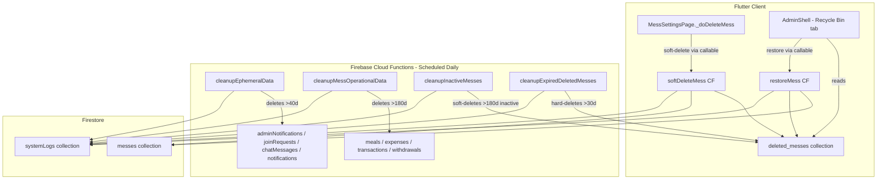

# Design Document: Data Deletion & Recovery Policy

## Overview

This feature introduces a multi-tier automated data lifecycle management system for the Meal Manager app. It combines:

1. **Scheduled Cloud Functions** (Firebase Functions v2 `onSchedule`) that run daily to enforce retention policies
2. **Soft-delete flow** replacing the existing hard-delete in `_doDeleteMess()`
3. **Admin Recycle Bin UI** — a new tab in `AdminShell` for viewing and restoring soft-deleted messes

The system enforces three retention windows:
- **40 days** — ephemeral data (notifications, join requests, chat)
- **6 months (180 days)** — operational mess data (meals, expenses, transactions, withdrawals)
- **30 days** — soft-deleted messes in the recycle bin before permanent hard-delete

All cleanup operations are batched at ≤500 Firestore ops per batch and logged to `systemLogs`.

---

## Architecture



### Component Responsibilities

| Component | Responsibility |
|---|---|
| `softDeleteMess` (callable CF) | Moves mess to `deleted_messes`, clears member `messId`/`role`, logs |
| `restoreMess` (callable CF) | Moves mess back to `messes`, removes from `deleted_messes`, logs |
| `cleanupEphemeralData` (scheduled) | Deletes 40-day-old ephemeral docs |
| `cleanupMessOperationalData` (scheduled) | Deletes 6-month-old operational subcollection docs |
| `cleanupInactiveMesses` (scheduled) | Soft-deletes messes inactive for 6 months |
| `cleanupExpiredDeletedMesses` (scheduled) | Hard-deletes recycle bin entries older than 30 days |
| `MessSettingsPage` (Flutter) | Calls `softDeleteMess` callable instead of direct Firestore delete |
| `AdminRecycleBinPage` (Flutter) | Lists `deleted_messes`, shows restore/expired state |

---

## Components and Interfaces

### Cloud Functions (TypeScript)

**File structure:**
```
functions/src/
  index.ts                        # exports all functions
  cleanup/
    cleanupEphemeralData.ts
    cleanupMessOperationalData.ts
    cleanupInactiveMesses.ts
    cleanupExpiredDeletedMesses.ts
  callable/
    softDeleteMess.ts
    restoreMess.ts
  utils/
    batchDelete.ts                # chunked batch deletion helper
    logging.ts                    # systemLogs writer
```

**`batchDelete` utility:**
```typescript
// Deletes a QuerySnapshot in batches of ≤500
async function batchDelete(
  db: Firestore,
  snap: QuerySnapshot,
): Promise<number>
```

**`writeSysLog` utility:**
```typescript
async function writeSysLog(db: Firestore, entry: {
  type: string;
  target?: string;
  messId?: string;
  count?: number;
  deletedBy?: string;
  restoredBy?: string;
  deletedAt?: FieldValue;
  restoredAt?: FieldValue;
  triggeredBy: string;
}): Promise<void>
```

**Callable: `softDeleteMess`**
- Auth required: caller must be the mess manager
- Input: `{ messId: string }`
- Steps:
  1. Read `messes/{messId}` — verify `managerId == callerUid`
  2. Write to `deleted_messes/{messId}` with all original fields + `deletedAt`, `deletedBy`, `isDeleted: true`
  3. Delete `messes/{messId}` root doc (subcollections remain in place)
  4. Batch-update all `members` docs: clear `messId`, set `role: 'member'`
  5. Write `systemLogs` entry

**Callable: `restoreMess`**
- Auth required: caller must have admin role
- Input: `{ messId: string }`
- Steps:
  1. Read `deleted_messes/{messId}` — verify `deletedAt` is within 30 days
  2. Write to `messes/{messId}` with original fields, remove `isDeleted`, add `restoredAt`
  3. Delete `deleted_messes/{messId}`
  4. Write `systemLogs` entry

### Flutter Changes

**`MessSettingsPage._doDeleteMess()` — updated flow:**
```dart
// Instead of direct Firestore batch delete:
// 1. Show updated confirmation dialog mentioning 30-day recovery
// 2. Call FirebaseFunctions.instance.httpsCallable('softDeleteMess')
//    with { 'messId': _messId }
// 3. On success: show snackbar "Mess deleted. Recoverable within 30 days."
//    then navigate to '/create-join-mess'
```

**`AdminRecycleBinPage` — new widget:**
```dart
// lib/features/admin/pages/admin_recycle_bin_page.dart
// StreamBuilder on FirebaseFirestore.instance.collection('deleted_messes')
//   .orderBy('deletedAt', descending: true)
// For each doc:
//   - Show: mess name, messId, deletedAt, deletedBy, deletionReason, daysRemaining
//   - If daysRemaining > 0: show "Restore" button → calls restoreMess callable
//   - If daysRemaining <= 0: show "Expired" chip
```

**`AdminShell` — add Recycle Bin tab:**
- Add `_NavItem(Icons.delete_sweep_rounded, 'Recycle Bin')` to `_navItems`
- Add `AdminRecycleBinPage()` to `_pages`

---

## Data Models

### `messes/{messId}` — existing fields + new field

```
{
  name: string,
  address: string,
  managerId: string,
  subscription: string,
  mealEntryMode: string,
  setupComplete: bool,
  createdAt: Timestamp,
  lastActivityAt: Timestamp,   // NEW — updated on meal/expense/transaction/withdrawal write
  bazarSchedule: string[],
  ...
}
```

`lastActivityAt` is set on mess creation and updated via a Firestore trigger (or within the existing write paths) whenever a document is created/updated in `meals`, `expenses`, `transactions`, or `withdrawals` subcollections.

### `deleted_messes/{messId}` — new collection

```
{
  // All original mess fields preserved, plus:
  deletedAt: Timestamp,        // when soft-delete occurred
  deletedBy: string,           // manager UID or 'system'
  isDeleted: true,
  deletionReason: string,      // 'manager_request' | 'inactivity'
  restoredAt?: Timestamp,      // set on restore (before moving back)
}
```

### `systemLogs/{autoId}` — new/extended collection

```
{
  type: string,          // 'auto_deletion' | 'soft_delete' | 'mess_restored'
  target?: string,       // collection name or messId for auto deletions
  messId?: string,
  count?: number,        // docs deleted in auto jobs
  deletedAt?: Timestamp,
  restoredAt?: Timestamp,
  deletedBy?: string,
  restoredBy?: string,
  triggeredBy: string,   // 'scheduler' | uid
}
```

### Firestore Security Rules additions

```javascript
match /deleted_messes/{messId} {
  allow read, write: if request.auth != null &&
    request.auth.token.role in ['superAdmin','systemAdmin','supportAdmin','contentAdmin'];
}
match /systemLogs/{logId} {
  allow read: if request.auth != null &&
    request.auth.token.role in ['superAdmin','systemAdmin','supportAdmin','contentAdmin'];
  allow write: if false; // only Cloud Functions (Admin SDK) write here
}
```

### Activity Tracking Trigger

A Firestore `onWrite` trigger on `messes/{messId}/{subcol}/{docId}` where `subcol in ['meals','expenses','transactions','withdrawals']` updates `lastActivityAt` on the parent mess document:

```typescript
// functions/src/triggers/updateLastActivity.ts
export const updateLastActivity = onDocumentWritten(
  'messes/{messId}/{subcol}/{docId}',
  async (event) => {
    const { messId, subcol } = event.params;
    const tracked = ['meals','expenses','transactions','withdrawals'];
    if (!tracked.includes(subcol)) return;
    await db.collection('messes').doc(messId).update({
      lastActivityAt: FieldValue.serverTimestamp(),
    });
  }
);
```

---

## Correctness Properties

*A property is a characteristic or behavior that should hold true across all valid executions of a system — essentially, a formal statement about what the system should do. Properties serve as the bridge between human-readable specifications and machine-verifiable correctness guarantees.*


### Property 1: Activity write updates lastActivityAt

*For any* mess and any write to its `meals`, `expenses`, `transactions`, or `withdrawals` subcollection, the mess document's `lastActivityAt` field must be updated to a timestamp that is greater than or equal to the timestamp before the write.

**Validates: Requirements 1.1, 1.3**

### Property 2: Soft-delete output structure

*For any* mess (whether deleted by a manager or by the inactivity scheduler), the resulting document in `deleted_messes/{messId}` must contain all original mess fields plus `deletedAt` (a Timestamp), `deletedBy` (a non-empty string), `isDeleted: true`, and `deletionReason` (`'manager_request'` or `'inactivity'`).

**Validates: Requirements 2.1, 6.3**

### Property 3: Soft-delete removes mess from active collection

*For any* mess that has been soft-deleted, querying `messes/{messId}` must return no document.

**Validates: Requirements 2.2**

### Property 4: Soft-delete clears all member documents

*For any* mess with N members that is soft-deleted, all N member user documents must have `messId` set to an empty string and `role` set to `'member'` after the operation.

**Validates: Requirements 2.3, 6.4**

### Property 5: Subcollections survive soft-delete

*For any* mess that has been soft-deleted, the subcollection documents under `messes/{messId}` (meals, expenses, transactions, withdrawals, monthSummaries, members, joinRequests) must still exist and have the same count as before the soft-delete.

**Validates: Requirements 2.5**

### Property 6: Batch size never exceeds 500 operations

*For any* collection of N documents passed to the `batchDelete` utility, the function must never issue a single Firestore batch with more than 500 write operations, regardless of N.

**Validates: Requirements 3.3**

### Property 7: Permanent deletion removes both root documents

*For any* mess that has been permanently deleted by the expiry job, neither `messes/{messId}` nor `deleted_messes/{messId}` must exist after the job completes.

**Validates: Requirements 3.4**

### Property 8: Ephemeral cleanup date filter selects only docs older than 40 days

*For any* set of documents in `adminNotifications`, `joinRequests`, `chatMessages`, or `notifications` with mixed timestamps, the 40-day cleanup job must select exactly those documents whose relevant timestamp (`sentAt` or `createdAt`) is strictly older than 40 days, and must not select any document within the 40-day window.

**Validates: Requirements 4.2, 4.3, 4.4, 4.5**

### Property 9: Ephemeral cleanup never touches protected collections

*For any* execution of the 40-day ephemeral cleanup job, the collections `meals`, `expenses`, `transactions`, `withdrawals`, and `monthSummaries` must have the same document count after the job as before.

**Validates: Requirements 4.6**

### Property 10: Operational data cleanup date filter selects only docs older than 180 days

*For any* set of documents in a mess's `meals`, `expenses`, `transactions`, or `withdrawals` subcollection with mixed timestamps, the 6-month cleanup job must select exactly those documents whose relevant date field is strictly older than 180 days.

**Validates: Requirements 5.2, 5.3, 5.4, 5.5**

### Property 11: 6-month cleanup never touches monthSummaries or members

*For any* execution of the 6-month operational data cleanup job, the `monthSummaries` and `members` subcollections must have the same document count after the job as before.

**Validates: Requirements 5.6**

### Property 12: Inactivity query selects only messes inactive for 180+ days

*For any* set of mess documents with mixed `lastActivityAt` timestamps, the inactivity detection job must select exactly those messes whose `lastActivityAt` (or `createdAt` if missing) is strictly older than 180 days.

**Validates: Requirements 6.2**

### Property 13: Restore round-trip

*For any* soft-deleted mess within the 30-day recovery window, calling restore must result in: (a) a document at `messes/{messId}` containing all original fields plus `restoredAt`, without `isDeleted`, and (b) no document at `deleted_messes/{messId}`.

**Validates: Requirements 7.4, 7.5**

### Property 14: Restore button visibility follows 30-day window

*For any* deleted mess document, the Recycle Bin UI must show a "Restore" button if and only if `deletedAt` is within the last 30 days; for any document with `deletedAt` older than 30 days, no Restore button must appear and an "Expired" indicator must be shown instead.

**Validates: Requirements 7.3, 7.7**

### Property 15: Recycle Bin renders all required fields

*For any* document in `deleted_messes`, the rendered Recycle Bin list item must display: mess name, mess ID, deletion date, `deletedBy`, `deletionReason`, and the number of days remaining in the recovery window.

**Validates: Requirements 7.2**

### Property 16: Recycle Bin list is ordered newest-first

*For any* set of documents in `deleted_messes`, the Recycle Bin page must display them in descending order of `deletedAt` (most recently deleted first).

**Validates: Requirements 7.8**

### Property 17: systemLogs entry structure for all deletion and restore events

*For any* automated deletion run or manual soft-delete or restore operation, the resulting `systemLogs` entry must contain: `type` (non-empty string), `triggeredBy` (non-empty string), and at least one of `deletedAt` or `restoredAt` as a Timestamp. Automated jobs must also include `target` and `count`; soft-delete entries must include `messId` and `deletedBy`; restore entries must include `messId` and `restoredBy`.

**Validates: Requirements 9.1, 9.2, 9.3**

---

## Error Handling

### Cloud Functions

| Scenario | Behavior |
|---|---|
| Soft-delete: caller is not the mess manager | Callable throws `permission-denied` |
| Soft-delete: mess does not exist | Callable throws `not-found` |
| Restore: mess not in deleted_messes | Callable throws `not-found` |
| Restore: recovery window expired | Callable throws `failed-precondition` with message "Recovery window expired" |
| Restore: caller is not a system admin | Callable throws `permission-denied` |
| Scheduled job: error on one mess | Log error to `systemLogs` with `type: 'cleanup_error'`, continue to next mess |
| Batch write failure | Retry up to 3 times with exponential backoff; log if all retries fail |
| `lastActivityAt` missing on mess | Fall back to `createdAt` for all inactivity calculations |

### Flutter Client

| Scenario | Behavior |
|---|---|
| `softDeleteMess` callable fails | Show error snackbar with message from exception; do not navigate away |
| `restoreMess` callable fails | Show error snackbar; keep Recycle Bin list visible |
| Recycle Bin stream error | Show inline error widget with retry button |
| Network unavailable during delete | Show "No connection" snackbar; callable will fail gracefully |

---

## Testing Strategy

### Dual Testing Approach

Both unit tests and property-based tests are required. Unit tests cover specific examples, integration points, and error conditions. Property-based tests verify universal correctness across randomly generated inputs.

### Unit Tests (Dart — `flutter_test` + `fake_cloud_firestore`)

Focus areas:
- `_doDeleteMess()` replacement: verify callable is invoked with correct `messId`, success navigation, error snackbar
- `AdminRecycleBinPage`: verify list renders, Restore button present/absent based on `deletedAt`, expired chip shown
- `AdminShell`: verify Recycle Bin tab is present at the correct index
- Security rule examples (Firebase emulator): admin can read `deleted_messes`, non-admin gets permission-denied
- Error isolation example: mock one mess to throw during cleanup, verify others are processed

### Property-Based Tests (TypeScript — `fast-check`)

Each property test must run a minimum of **100 iterations**.

Tag format for each test: `// Feature: data-deletion-recovery-policy, Property N: <property_text>`

| Property | Test approach |
|---|---|
| P1: Activity write updates lastActivityAt | Generate random subcol doc writes; assert `lastActivityAt` increases |
| P2: Soft-delete output structure | Generate random mess data + caller type; assert `deleted_messes` doc fields |
| P3: Soft-delete removes from messes | Generate random messId; assert `messes/{messId}` absent after soft-delete |
| P4: Soft-delete clears member docs | Generate random member lists; assert all cleared after soft-delete |
| P5: Subcollections survive soft-delete | Generate random subcollection sizes; assert counts unchanged after soft-delete |
| P6: Batch size ≤500 | Generate arrays of 1–2000 docs; assert no batch exceeds 500 ops |
| P7: Permanent deletion removes both docs | Generate expired deleted_messes entries; assert both docs absent after job |
| P8: Ephemeral date filter | Generate mixed-age doc sets; assert only >40d docs selected |
| P9: Ephemeral cleanup excludes protected collections | Generate full mess state; assert protected collection counts unchanged |
| P10: Operational data date filter | Generate mixed-age operational docs; assert only >180d docs selected |
| P11: 6-month cleanup excludes monthSummaries/members | Generate full mess state; assert excluded collection counts unchanged |
| P12: Inactivity query date filter | Generate messes with mixed lastActivityAt; assert only >180d selected |
| P13: Restore round-trip | Generate soft-deleted mess within window; assert messes doc restored, deleted_messes absent |
| P14: Restore button visibility | Generate deletedAt timestamps across range; assert button shown iff within 30d |
| P15: Recycle Bin renders required fields | Generate random deleted_messes docs; assert all fields present in rendered output |
| P16: Recycle Bin ordering | Generate random-ordered deleted_messes lists; assert rendered order is descending by deletedAt |
| P17: systemLogs entry structure | Generate deletion/restore events; assert log entry contains required fields |

### Property-Based Testing Library

Use **`fast-check`** (npm) for TypeScript Cloud Function tests.
Use **`glados`** (pub.dev) for Dart Flutter widget tests.

Each property test must be tagged and run with at least 100 iterations:

```typescript
// Example (TypeScript / fast-check)
// Feature: data-deletion-recovery-policy, Property 6: Batch size never exceeds 500 operations
it('batchDelete never issues batch > 500 ops', async () => {
  await fc.assert(
    fc.asyncProperty(fc.array(fc.string(), { minLength: 1, maxLength: 2000 }), async (ids) => {
      const batches = collectBatches(ids);
      expect(batches.every(b => b.length <= 500)).toBe(true);
    }),
    { numRuns: 100 }
  );
});
```

```dart
// Example (Dart / glados)
// Feature: data-deletion-recovery-policy, Property 14: Restore button visibility follows 30-day window
test('restore button shown iff deletedAt within 30 days', () {
  Glados<DateTime>().test('restore button visibility', (deletedAt) {
    final daysAgo = DateTime.now().difference(deletedAt).inDays;
    final widget = buildRecycleBinItem(deletedAt: deletedAt);
    if (daysAgo <= 30) {
      expect(find.text('Restore'), findsOneWidget);
    } else {
      expect(find.text('Restore'), findsNothing);
      expect(find.text('Expired'), findsOneWidget);
    }
  });
});
```
