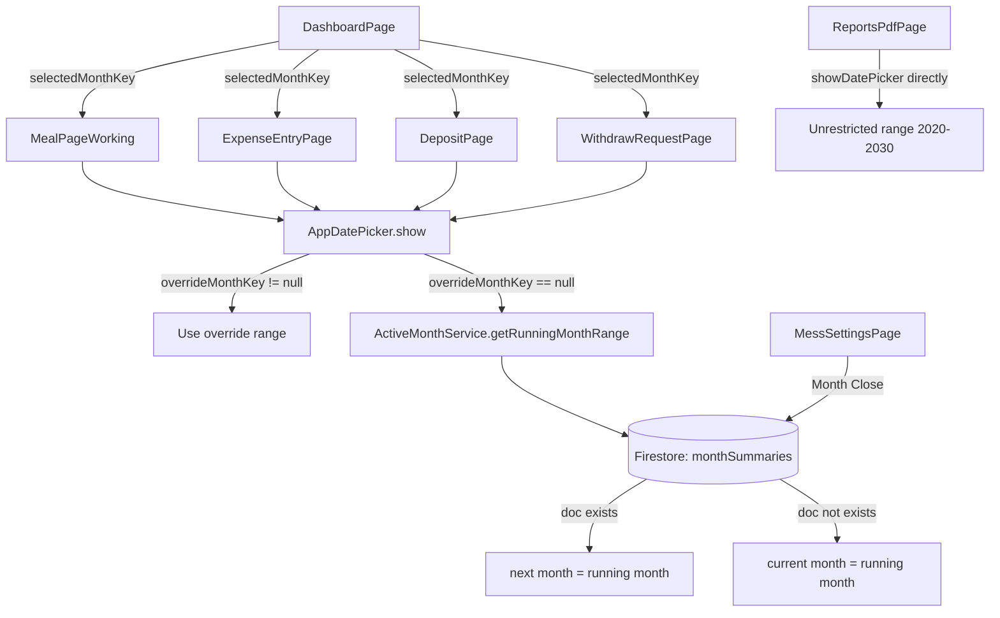

# Design Document

## Feature: Date Selection Running Month Restriction

---

## Overview

এই ফিচারটি নিশ্চিত করে যে অ্যাপের রিপোর্ট পেজ বাদে সকল ডেট পিকারে শুধুমাত্র "রানিং মাস"-এর তারিখ সিলেক্ট করা যাবে। রানিং মাস ক্যালেন্ডারের বর্তমান মাস নয়, বরং সিস্টেমের active/open মাস দিয়ে নির্ধারিত হয়।

মূল নীতি:
- `ActiveMonthService` Firestore-এ `monthSummaries` collection চেক করে রানিং মাস নির্ধারণ করে।
- যদি বর্তমান ক্যালেন্ডার মাস close না হয়, সেটাই রানিং মাস।
- যদি close হয়, পরের মাস রানিং মাস।
- Home > Top bar থেকে month switch করলে সেই মাসই সাময়িকভাবে রানিং মাস হিসেবে গণ্য হয়।
- `AppDatePicker` centralized utility হিসেবে সব non-report page-এ ব্যবহৃত হয়।

---

## Architecture



**মূল ডিজাইন সিদ্ধান্ত:**

1. **Context Propagation via Constructor Parameters**: Flutter-এ InheritedWidget বা Provider ব্যবহার না করে সহজ constructor parameter দিয়ে `selectedMonthKey` পাস করা হবে। এটি dependency কম রাখে এবং explicit করে।

2. **AppDatePicker-এ optional overrideMonthKey**: যখন user month switch করে, `overrideMonthKey` পাস করা হয়। না করলে `ActiveMonthService` query হয়।

3. **MealPage navigation arrows**: `ActiveMonthService` থেকে range নিয়ে arrow enable/disable করা হয়। এটি ইতিমধ্যে partial implementation আছে, শুধু `selectedMonthKey` context যোগ করতে হবে।

---

## Components and Interfaces

### 1. `ActiveMonthService` (বিদ্যমান, পরিবর্তন নেই)

`lib/core/services/active_month_service.dart`

```dart
class ActiveMonthService {
  static Future<String> getRunningMonthKey(String messId) async { ... }
  static Future<DateTimeRange> getRunningMonthRange(String messId) async { ... }
}
```

বিদ্যমান implementation সঠিক। শুধু `DateTimeRange` import ঠিক করতে হবে (`package:flutter/material.dart`)।

### 2. `AppDatePicker` (পরিবর্তন প্রয়োজন)

`lib/core/utils/app_date_picker.dart`

```dart
class AppDatePicker {
  static Future<DateTime?> show({
    required BuildContext context,
    required String messId,
    DateTime? initialDate,
    String? overrideMonthKey, // নতুন optional parameter
  }) async { ... }
}
```

`overrideMonthKey` দেওয়া হলে `ActiveMonthService` query না করে সেই month-এর range ব্যবহার করবে।

### 3. `DashboardPage` (পরিবর্তন প্রয়োজন)

`lib/features/dashboard/presentation/pages/dashboard_page.dart`

Top bar-এ month switch UI যোগ করতে হবে। Switch করলে `_selectedMonthKey` state update হবে এবং child pages-এ pass হবে।

```dart
class _DashboardPageState extends State<DashboardPage> {
  String? _selectedMonthKey; // null = use running month from service

  // Top bar-এ previous/next month navigation
  // _selectedMonthKey পরিবর্তন হলে pages rebuild হবে
}
```

### 4. `MealPageWorking` (পরিবর্তন প্রয়োজন)

`lib/features/meal/presentation/pages/meal_page_working.dart`

```dart
class MealPageWorking extends StatefulWidget {
  final String? selectedMonthKey; // DashboardPage থেকে আসবে
  const MealPageWorking({super.key, this.selectedMonthKey});
}
```

- `AppDatePicker.show` call-এ `overrideMonthKey: widget.selectedMonthKey` পাস করবে।
- Navigation arrows-এ `selectedMonthKey` দিয়ে range নির্ধারণ করবে।

### 5. `ExpenseEntryPage`, `DepositPage`, `WithdrawRequestPage` (পরিবর্তন প্রয়োজন)

যদি ভবিষ্যতে date picker যোগ হয়, তাহলে `selectedMonthKey` parameter নেবে এবং `AppDatePicker.show` ব্যবহার করবে।

বর্তমানে এই pages-এ date picker নেই, তাই শুধু parameter যোগ করা হবে।

### 6. `ReportsPdfPage` (পরিবর্তন নেই)

বিদ্যমান `showDatePicker` সরাসরি ব্যবহার করে `DateTime(2020)` থেকে `DateTime(2030)` range-এ। এটি অপরিবর্তিত থাকবে।

---

## Data Models

### MonthKey Format

```
"YYYY-MM"  উদাহরণ: "2026-04"
```

### DateTimeRange (Running Month)

```dart
DateTimeRange(
  start: DateTime(year, month, 1),       // মাসের প্রথম দিন
  end: DateTime(year, month + 1, 0),     // মাসের শেষ দিন
)
```

### Firestore: monthSummaries Document

```
messes/{messId}/monthSummaries/{monthKey}
{
  "monthKey": "2026-04",
  "totalMeals": 150,
  "totalExpense": 12500.0,
  "mealRate": 83.33,
  "closedAt": Timestamp
}
```

এই document-এর existence দিয়ে `ActiveMonthService` running month নির্ধারণ করে।

### Selected Month Context Flow

```
DashboardPage._selectedMonthKey (String? — null means "use service")
  ↓ constructor param
MealPageWorking.selectedMonthKey
  ↓ overrideMonthKey
AppDatePicker.show(overrideMonthKey: ...)
  ↓ if null → ActiveMonthService.getRunningMonthRange(messId)
  ↓ if not null → compute range from overrideMonthKey directly
```

---

## Correctness Properties

*A property is a characteristic or behavior that should hold true across all valid executions of a system — essentially, a formal statement about what the system should do. Properties serve as the bridge between human-readable specifications and machine-verifiable correctness guarantees.*

### Property 1: No Month Close → Current Month is Running Month

*For any* `messId` where no `monthSummaries` document exists for the current calendar month, `ActiveMonthService.getRunningMonthKey` SHALL return the current calendar month key in `"YYYY-MM"` format.

**Validates: Requirements 1.1, 6.4**

---

### Property 2: Month Close → Next Month is Running Month

*For any* `messId` where a `monthSummaries` document exists for the current calendar month, `ActiveMonthService.getRunningMonthKey` SHALL return the next calendar month key in `"YYYY-MM"` format.

**Validates: Requirements 1.2, 6.2**

---

### Property 3: Running Month Range Boundaries

*For any* running month key `"YYYY-MM"`, the `DateTimeRange` returned by `ActiveMonthService.getRunningMonthRange` SHALL have `start` equal to the first day of that month (day 1) and `end` equal to the last day of that month.

**Validates: Requirements 1.3, 3.1**

---

### Property 4: InitialDate Clamping

*For any* `initialDate` passed to `AppDatePicker.show` that falls outside the running month range, the effective `initialDate` used in `showDatePicker` SHALL be clamped to the nearest valid date within the running month (i.e., `max(firstDay, min(lastDay, initialDate))`).

**Validates: Requirements 3.4**

---

### Property 5: Override Month Key Takes Precedence

*For any* call to `AppDatePicker.show` with a non-null `overrideMonthKey`, the `firstDate` and `lastDate` passed to `showDatePicker` SHALL correspond to the first and last day of the override month, regardless of what `ActiveMonthService` would return.

**Validates: Requirements 2.2, 5.6**

---

### Property 6: Month Close Creates Summary Document

*For any* `messId` and current month key, after `_doMonthClose()` completes successfully, a document SHALL exist at `messes/{messId}/monthSummaries/{monthKey}`.

**Validates: Requirements 6.1**

---

### Property 7: Day Navigation Stays Within Running Month

*For any* sequence of "previous day" and "next day" navigation operations on `MealPageWorking`, the resulting `_selectedDate` SHALL always satisfy: `firstDayOfRunningMonth <= _selectedDate <= lastDayOfRunningMonth`.

**Validates: Requirements 7.1, 7.2, 7.5**

---

## Error Handling

| পরিস্থিতি | আচরণ |
|---|---|
| Firestore query fail (ActiveMonthService) | Current calendar month key fallback হিসেবে return করবে (Requirement 1.4) |
| messId empty string | ActiveMonthService current month return করবে |
| overrideMonthKey invalid format | AppDatePicker ActiveMonthService fallback ব্যবহার করবে |
| initialDate null | DateTime.now() ব্যবহার করবে, তারপর clamp করবে |
| Month close Firestore error | SnackBar-এ error দেখাবে, monthSummaries document তৈরি হবে না |

---

## Testing Strategy

### Unit Tests (নির্দিষ্ট উদাহরণ ও edge case)

- `ActiveMonthService.getRunningMonthKey` — no document → current month
- `ActiveMonthService.getRunningMonthKey` — document exists → next month
- `ActiveMonthService.getRunningMonthRange` — range start/end সঠিক
- `AppDatePicker` — `overrideMonthKey` দিলে সঠিক range ব্যবহার হয়
- `AppDatePicker` — `initialDate` clamping (before range, after range, within range)
- Report page — `showDatePicker` সরাসরি ব্যবহার করে, `AppDatePicker` নয়
- `MealPageWorking` — first day-এ previous arrow disabled
- `MealPageWorking` — last day-এ next arrow disabled

### Property-Based Tests (সার্বজনীন property)

Property-based testing library: **[dart_test](https://pub.dev/packages/test)** + **[fast_check](https://pub.dev/packages/fast_check)** (Dart-এর জন্য)।

প্রতিটি property test minimum **100 iterations** চালাবে।

প্রতিটি test-এ comment tag থাকবে:
`// Feature: date-selection-running-month-restriction, Property N: <property_text>`

**Property 1 Test:**
```dart
// Feature: date-selection-running-month-restriction, Property 1: No close → current month
// For any messId with no monthSummaries doc, getRunningMonthKey returns current month key
test('property: no close returns current month', () async {
  // Mock Firestore: doc does not exist
  // Assert: returned key == currentMonthKey
});
```

**Property 2 Test:**
```dart
// Feature: date-selection-running-month-restriction, Property 2: Close → next month
// For any messId with monthSummaries doc for current month, returns next month key
test('property: close returns next month', () async {
  // Mock Firestore: doc exists for current month
  // Assert: returned key == nextMonthKey
});
```

**Property 3 Test:**
```dart
// Feature: date-selection-running-month-restriction, Property 3: Range boundaries
// For any month key, range.start == first day, range.end == last day
test('property: range boundaries correct for any month', () {
  // Generate random year (2020-2030) and month (1-12)
  // Assert: range.start.day == 1
  // Assert: range.end == last day of month
});
```

**Property 4 Test:**
```dart
// Feature: date-selection-running-month-restriction, Property 4: InitialDate clamping
// For any initialDate outside running month, clamped date is within range
test('property: initialDate always clamped to running month', () {
  // Generate random dates before and after running month
  // Assert: clamped date >= range.start && clamped date <= range.end
});
```

**Property 5 Test:**
```dart
// Feature: date-selection-running-month-restriction, Property 5: Override takes precedence
// For any overrideMonthKey, picker uses that month's range
test('property: overrideMonthKey overrides service result', () {
  // Provide overrideMonthKey different from service result
  // Assert: firstDate/lastDate match override month, not service month
});
```

**Property 7 Test:**
```dart
// Feature: date-selection-running-month-restriction, Property 7: Navigation stays in range
// For any sequence of prev/next navigation, selectedDate stays within running month
test('property: day navigation never exits running month', () {
  // Generate random navigation sequences (prev/next)
  // Assert: selectedDate always within [firstDay, lastDay]
});
```

**Unit Test (Example — Report Page):**
```dart
// Feature: date-selection-running-month-restriction, Example: Report page unrestricted
test('example: report page allows dates from 2020 to 2030', () {
  // Verify ReportsPdfPage uses showDatePicker with firstDate: DateTime(2020), lastDate: DateTime(2030)
});
```
