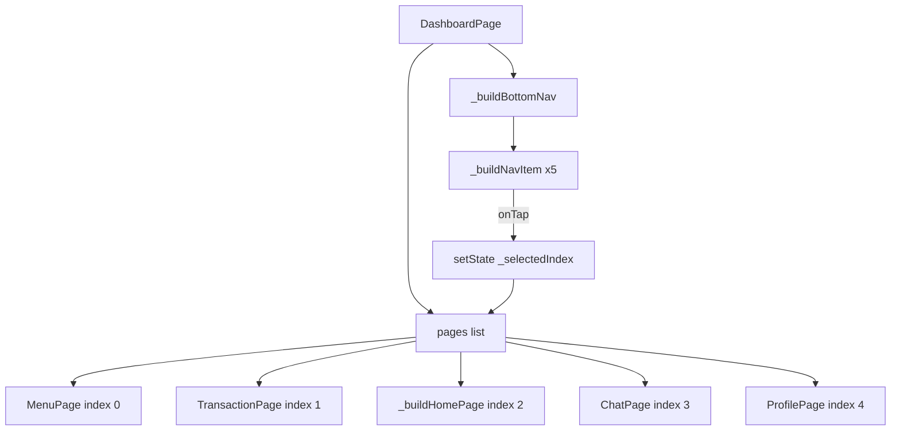

# Design Document: Footer Menu Organize

## Overview

This feature reorganizes the `DashboardPage` bottom navigation bar from the current five-tab layout (Meal | Member | Home | Transaction | Menu) to a new layout (Menu | Transaction | Home | Chat | Profile). The change promotes Profile from the app bar popup into a first-class footer tab, introduces Chat as a dedicated footer tab, and removes Meal and Member from the bottom nav (they remain accessible via Quick Actions on the Home tab).

The scope is intentionally narrow: only `DashboardPage` needs modification. Both `ChatPage` and `ProfilePage` already exist in the codebase and require no changes.

---

## Architecture

The bottom navigation is entirely self-contained within `DashboardPage` (`lib/features/dashboard/presentation/pages/dashboard_page.dart`). There is no separate navigation controller or router integration — tab switching is handled by `setState(() => _selectedIndex = i)`.

The `_onActionTap` method in Quick Actions also sets `_selectedIndex` directly — these hardcoded values must be updated to match the new indices.

---

## Components and Interfaces

### Modified: `_DashboardPageState`

**`pages` list** — reordered and replaced:

| Index | Old Widget | New Widget |
|-------|-----------|-----------|
| 0 | `MealPageWorking` | `MenuPage` |
| 1 | `MemberPage` | `TransactionPage` |
| 2 | `_buildHomePage()` | `_buildHomePage()` (unchanged) |
| 3 | `TransactionPage` | `ChatPage` |
| 4 | `MenuPage` | `ProfilePage` |

**`_buildBottomNav()`** — updated nav items:

| Index | Icon | Label |
|-------|------|-------|
| 0 | `Icons.grid_view_rounded` | Menu |
| 1 | `Icons.receipt_long` | Transaction |
| 2 | `Icons.home_rounded` | Home |
| 3 | `Icons.chat_bubble_outline_rounded` | Chat |
| 4 | `Icons.person_outline_rounded` | Profile |

**`_onActionTap()`** — updated index references:

| Action label | Old index | New index |
|-------------|-----------|-----------|
| `'Menu'` | 4 | 0 |
| `'Transaction'` | 3 | 1 |
| `'Members'` | 1 | removed (no footer tab) |
| `'Meal'` | 0 | removed (no footer tab) |

**Initial state** — `_selectedIndex` stays at `2` (Home), which is correct for the new layout.

### Unchanged Components

- `ProfilePage` — no changes needed
- `ChatPage` — no changes needed
- `MessSettingsPage`, `MenuPage`, `TransactionPage` — no changes needed
- App bar popup menu — Profile entry can be retained for discoverability (per Requirement 5.3 UX preference)

---

## Data Models

No new data models are introduced. The only state change is the integer `_selectedIndex` and the `pages` list ordering within `_DashboardPageState`. Both are local widget state.

---

## Correctness Properties

*A property is a characteristic or behavior that should hold true across all valid executions of a system — essentially, a formal statement about what the system should do. Properties serve as the bridge between human-readable specifications and machine-verifiable correctness guarantees.*

### Property 1: Tap navigation sets correct index and page

*For any* tab index `i` in `{0, 1, 2, 3, 4}`, tapping the nav item at position `i` shall set `_selectedIndex` to `i` and cause `pages[i]` to be the rendered body widget.

**Validates: Requirements 2.1, 2.2, 2.3, 2.4, 2.5, 3.3, 3.4, 3.5, 3.6, 3.7**

### Property 2: Selected tab styling is exclusive

*For any* selected index `i` in `{0, 1, 2, 3, 4}`, the nav item at position `i` shall render with the selected visual style (green tint background, green icon/label color), and every nav item at position `j ≠ i` shall render with the unselected visual style (transparent background, grey icon/label color).

**Validates: Requirements 2.6, 2.7**

### Property 3: Deep link / programmatic navigation maps tab names to correct indices

*For any* tab name in `{'Menu', 'Transaction', 'Home', 'Chat', 'Profile'}`, a programmatic call targeting that tab name shall set `_selectedIndex` to the corresponding index (0, 1, 2, 3, 4 respectively).

**Validates: Requirements 4.1, 4.2, 4.3, 4.4, 4.5**

---

## Error Handling

This feature involves no network calls, async operations, or external dependencies. Error scenarios are limited to:

- **Invalid index**: `_selectedIndex` is always set via `setState` from a bounded set `{0..4}`. The `pages` list has exactly five entries, so index-out-of-bounds is impossible if the nav items and pages list stay in sync.
- **Missing page widget**: Both `ChatPage` and `ProfilePage` exist; no placeholder is needed.
- **Stale deep link references**: Any call site using old indices (0=Meal, 1=Member, 3=Transaction, 4=Menu) must be updated. The `_onActionTap` switch statement is the only such site in `DashboardPage`.

---

## Testing Strategy

### Unit / Widget Tests (example-based)

These cover the fixed structural requirements:

1. **Tab order test** — pump `DashboardPage`, find the bottom nav row, assert the five label strings appear in order: `['Menu', 'Transaction', 'Home', 'Chat', 'Profile']`.
2. **Default index test** — pump `DashboardPage`, assert the Home content widget is visible and `_selectedIndex == 2`.
3. **Pages list composition test** — verify `MenuPage`, `TransactionPage`, `ChatPage`, `ProfilePage` are present and `MealPageWorking` / `MemberPage` are absent from the nav-driven pages list.
4. **Quick Actions index test** — tap 'Menu' and 'Transaction' quick action buttons, assert `_selectedIndex` becomes 0 and 1 respectively.

### Property-Based Tests

Use the [`fast_check`](https://pub.dev/packages/fast_check) package (Dart PBT library). Each test runs a minimum of 100 iterations.

**Property 1 test** — `Feature: footer-menu-organize, Property 1: tap navigation sets correct index and page`
- Generator: integer in `[0, 4]`
- Action: tap `_buildNavItem` at generated index
- Assert: `_selectedIndex == generatedIndex` and `pages[generatedIndex]` widget type matches expected

**Property 2 test** — `Feature: footer-menu-organize, Property 2: selected tab styling is exclusive`
- Generator: integer in `[0, 4]`
- Action: set `_selectedIndex` to generated index
- Assert: nav item at that index has `AppColors.primaryGreen` tint; all others have transparent background and grey color

**Property 3 test** — `Feature: footer-menu-organize, Property 3: deep link maps tab names to correct indices`
- Generator: element from `[('Menu',0), ('Transaction',1), ('Home',2), ('Chat',3), ('Profile',4)]`
- Action: invoke programmatic navigation with tab name
- Assert: `_selectedIndex == expectedIndex`
